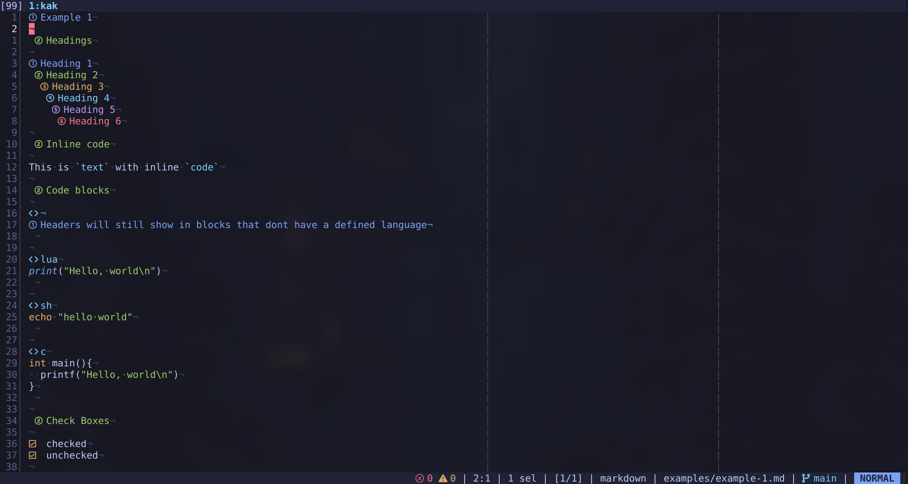
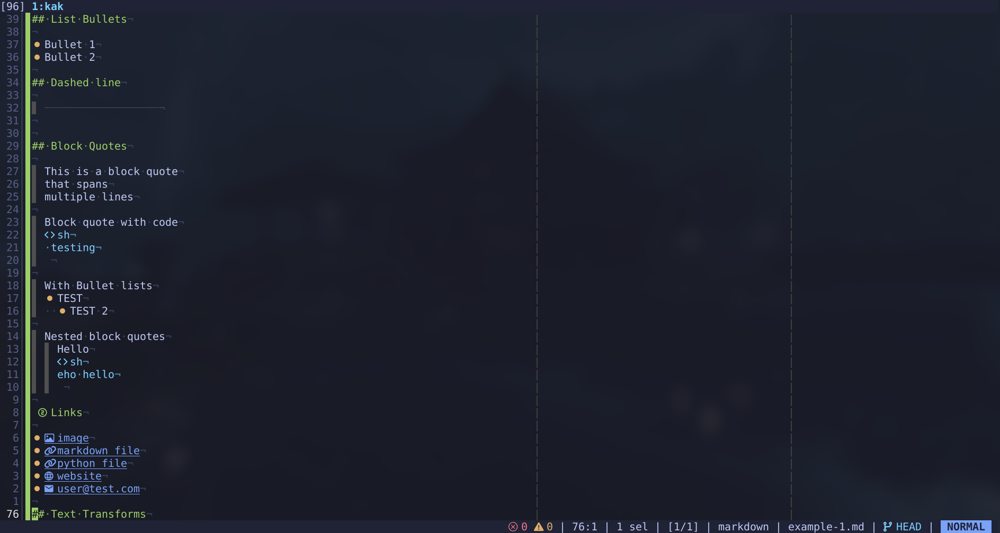
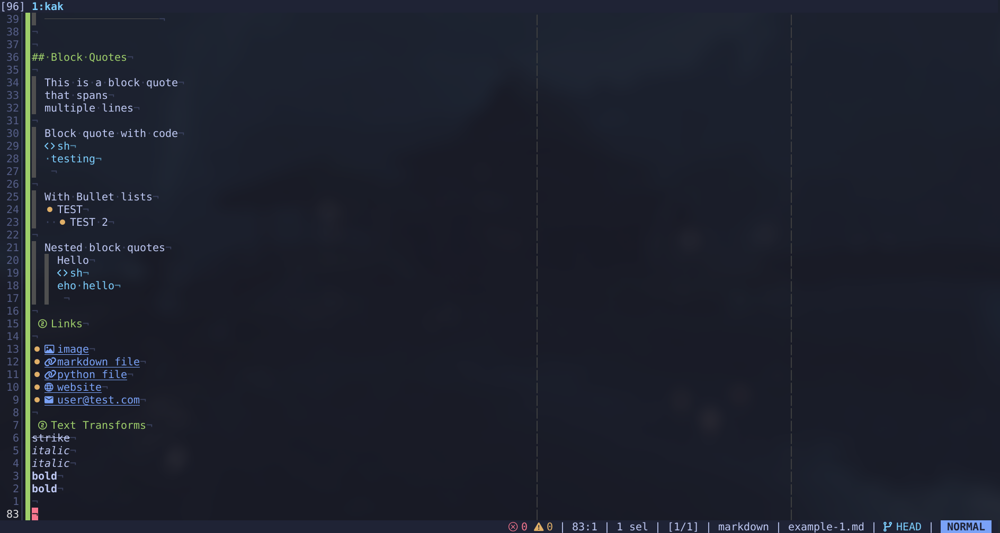

# render-markdown.kak

Improve viewing Markdown in Kakoune





## How to install

- NB: You need to have a nerdfont installed and set for your terminal

Copy [render-markdown.kak](./render-markdown.kak) into kakoune's `autoload` directory

Add this to your kakrc file
```kak
hook global WinSetOption filetype=markdown %{
  render-markdown-enable
}
```

## Rendering Support

Currently the plugin supports rendering
- Headings
- Codeblocks
- Checkboxes
- List bullets
- Horizontal rules
- Blockquotes
- Links
- Strikethroughs
- Italics
- Bold text
- Inline code

## Customisation

All rendered faces are set with `render_markdown_*` options
You can make changes to them according to your taste

## Known Issues
- Blockquotes `>` have to be followed by a horizontal space or they will not render
  - This is done so the original character can be seen when the cursor hovers over the position
- Headings `#*` are not rendered when they are in between codeblocks that don't have an assigned language
- No rendering for tables (Not really planned)

## Reference
- https://github.com/MeanderingProgrammer/render-markdown.nvim
