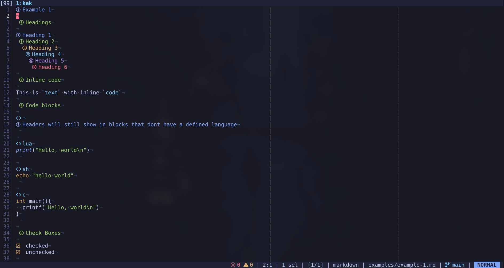
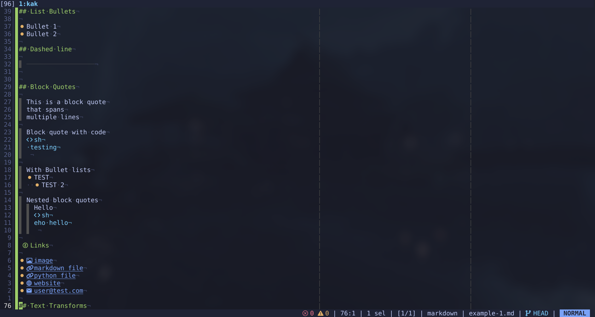
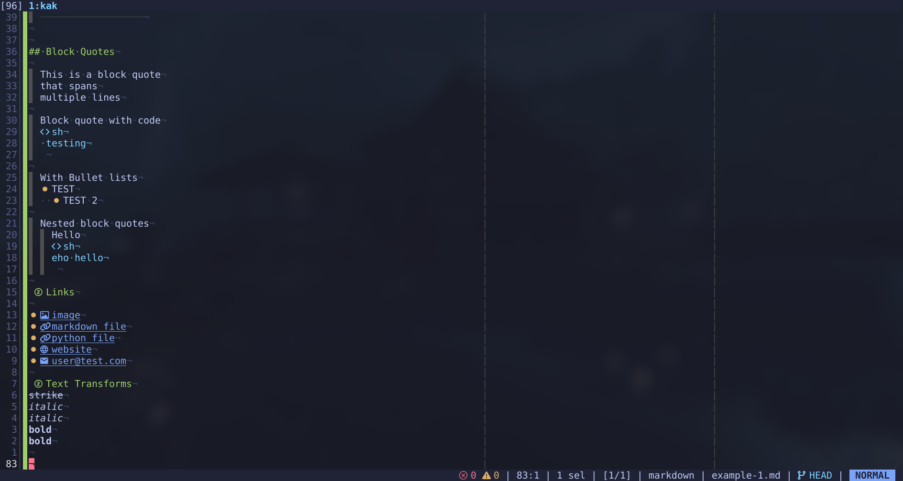

# render-markdown.kak

Improve viewing Markdown in Kakoune





## How to install

- NB: You need to have a nerdfont installed and set for your terminal

Copy [render-markdown.kak](./render-markdown.kak) into kakoune's `autoload` directory

Add this to your kakrc file
```kak
hook global WinSetOption filetype=markdown %{
  render-markdown-enable
}
```

## Quick test

From the repo root, open a sample with the plugin loaded and rendering
enabled:

kak -n -e 'source render-markdown.kak; render-markdown-enable' example.md

`example.md` covers all rendered constructs; `test/fixtures/mixed.md` is a
larger sample. The render happens automatically a moment after opening (the
update runs on NormalIdle), so no other setup is needed — just a terminal
with a nerd-font glyph set.

The plugin also renders `render_markdown_margin` lines above and below the
screen and caches them, so scrolling within that band reuses the ranges
instead of re-running the matchers. Code fences are the exception (their
markers are found across the whole buffer, since a block can outlive the
screen).

## Rendering Support

Currently the plugin supports rendering
- Headings (ATX, setext, including multi-line setext paragraphs)
- Codeblocks (backtick fences of three to six backticks)
- Checkboxes
- List markers (bullets, and ordered numbers kept in place)
- Thematic breaks (`---`, `***`, `___`, and spaced forms such as `- - -`)
- Blockquotes
- Links
- Strikethroughs
- Italics
- Bold text
- Inline code
- Tables (box-drawing grid; see Table commands)
- A leading YAML front matter block (hidden; a non-spec heuristic)

Emphasis follows CommonMark: `*` may emphasize inside a word (`a*b*c`) but
`_` never does (`a_b_c` stays literal), and delimiter runs are paired with
the flanking rules and the rule of 3. Mismatched runs (`___x_`), nested and
rule-of-3 spans (`*foo**bar*`, `**bold *it* bold**`) and inline code inside
emphasis all render as the spec says, in paragraphs as well as headings and
table cells.

## Customisation

Every face and marker glyph is a `render_markdown_*` option (defaults at the
top of `render-markdown.kak`); set one to change that rendering:

| Option | Controls |
| --- | --- |
| `render_markdown_heading_1` … `render_markdown_heading_6` | ATX/setext heading markers and faces |
| `render_markdown_codeblock_start`, `render_markdown_codeblock_end` | Opening and closing fence markers |
| `render_markdown_checkbox_checked`, `render_markdown_checkbox_unchecked` | Task-list checkboxes |
| `render_markdown_bullet`, `render_markdown_bullet_alt` | Unordered bullet markers, cycled by nesting depth (`indentwidth` steps, blockquote prefixes ignored); ordered numbers reuse the first's face |
| `render_markdown_horizontal_rule` | Thematic break line |
| `render_markdown_blockquote` | Blockquote marker |
| `render_markdown_link_image`, `render_markdown_link_web`, `render_markdown_link_link`, `render_markdown_link_mail` | Image, web, relative/reference and mail link prefixes |
| `render_markdown_strikethrough`, `render_markdown_italics`, `render_markdown_bold` | Inline text faces |
| `render_markdown_inline_code` | Inline code face |
| `render_markdown_table_separator`, `render_markdown_table_pipe` | Table grid line and cell bars |

Rendering is toggled with `render-markdown-enable`, `render-markdown-disable`
and `render-markdown-toggle`. `render_markdown_margin` (default 24) is not a
face: it sets how many lines beyond the viewport are rendered and cached.

## Table commands

- `render-markdown-table-select` — select the table enclosing the cursor
- `render-markdown-table-format` — align that table: pads each column to its
  widest cell and rewrites separator rows as dash runs (at least three dashes).
  Works with uneven rows; the indentation of the first line is kept.

Tables are rendered as a connecting grid: each `|` becomes a `│` bar and the
separator row becomes a `├─┼─┤` line. All replacement glyphs are single-width,
so column alignment is never disturbed. Inline emphasis, strikethrough, code
and links inside cells are rendered too: the cell keeps its display width by
padding the rendered text, so the pipes never move.

## Testing

Local, POSIX-only test suite (verified under `dash`):

```sh
dash test/run.sh [unit|integration|smoke|format|cache|bless|lint|all]
```

- `unit` — pure-shell tests for the classifier library (no Kakoune needed)
- `integration` — runs each fixture through a headless Kakoune session
  (`kak -ui json`, no terminal needed) and diffs the emitted range-specs
  against committed goldens. A fixture may carry a `<fixture>.cursor` file
  naming the line to render from, which covers scrolled viewports
- `smoke` — checks the replace-ranges highlighter really renders glyphs
- `format` — runs `render-markdown-table-format` and checks the line after
  the table is left intact
- `cache` — checks the margin render cache reuses ranges and re-renders after
  scrolling past them
- `bless` — regenerates goldens from current output (use when behaviour
  intentionally changes)
- `lint` — shellcheck on all shell scripts, plus a plugin sanity check
  (braces balanced, the embedded shell library parses)

With no argument the runner runs `all`: every test above except `bless`.

Requires `kak` for the integration and smoke tests. The shell scripts are
POSIX-only and verified under `dash` (any POSIX sh will also run them).
When a golden changes, review the diff and re-bless only if the change is
intended.

## Known Issues
- The range under the cursor is left in source form so you can see and edit it
  (Kakoune does not replace a range containing the cursor; expected, not a bug)
- YAML front matter is recognised by a heuristic (a leading `---` line with a
  closing `---` before the first blank line), not by the CommonMark spec;
  without the closing delimiter the block is left as ordinary Markdown
- Setext headings are recognised for the paragraph immediately above the
  underline; a list item or blockquote line directly above `---` stays a list
  or quote plus a rule
- An ATX heading's optional closing sequence (`## Heading ##`) is kept in the
  rendered text instead of being stripped
- Backtick fences longer than six backticks are not supported: the opening and
  closing runs must be the same length, and only lengths three through six are
  matched
- Inline code spans use a single backtick, so CommonMark's multi-backtick
  spans (a run of two or more backticks) are left literal
- Table cell inline rendering pads with trailing spaces, so cell text that
  contains emphasis is left-aligned rather than preserving interior spacing
- Links are matched separately from emphasis, so emphasis inside or around a
  link (`[a *b* c](url)`, `*[a](url)*`) emits overlapping ranges
- Autolinks (`<https://example.com>`) are not matched; only inline, reference
  and mail links are

## Reference
- https://github.com/MeanderingProgrammer/render-markdown.nvim
